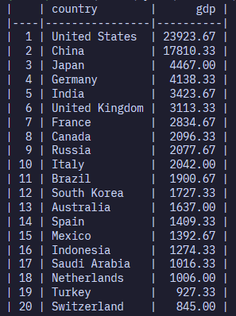
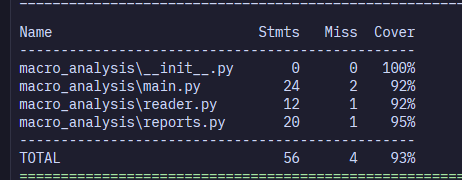

# Анализ макроэкономических данных

## Запуск
```bash
python -m venv .venv
.venv\scripts\activate #windows
.venv\bin\activate #unix
pip install -r requirements.txt
python -m macro_analysis.main --files examples/economic1.csv examples/economic2.csv --report average-gdp
```

---

## Запуск тестов:
```bash
python -m pytest
python -m pytest --cov=macro_analysis
```


---

## Добавление новых отчетов:

Создать новый класс отчёта в macro_analysis/reports.py

Реализовать метод generate
Добавить отчёт в словарь REPORTS:
```bash
REPORTS = {
    AverageGDPReport.name: AverageGDPReport(),
    AverageUnemploymentReport.name: AverageUnemploymentReport(),
}
```
